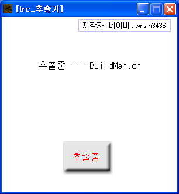

# 쥬라기원시전2 TRC추출기

쥬라기원시전2가 게임 데이터를 하나로 묶어 두는 아카이브 포맷(TRC)에서 개별 파일을 뽑아내는 추출기다. 파일 앞머리의 파일 테이블을 읽어 각 파일을 잘라내고, 추출과 동시에 다시 묶을 수 있는 목록(.trl)까지 만든다.

분석 결과는 [docs/trc-format.ko.md](docs/trc-format.ko.md) 에 정리해뒀다.

<p>
  
</p>


## 사용 방법

Releases에서 받아 압축을 풀고 실행하면 파일 선택창이 먼저 뜬다. 추출할 `.trc` 파일을 고르고, 그다음 폴더 선택창에서 저장 위치를 정하면 알아서 진행된다.

저장 폴더 안에 숫자 이름의 하위 폴더가 생기고 추출한 파일은 그 안에 들어간다. 같은 이름의 파일이 이미 있으면 다음 번호의 폴더를 새로 만든다. `<원본이름>_file_list.trl` 은 저장 폴더 바로 아래에 나온다.


## 구현 원리

**파일 테이블을 읽어 개수와 길이를 알아낸다.** TRC는 32바이트 엔트리가 늘어선 테이블로 시작한다. 헤더의 `0x0C` 에서 테이블 전체 길이를 읽어 엔트리 개수를 구하고, 엔트리마다 파일명(`+0x00`, 12바이트)과 길이(`+0x14`, 4바이트)를 읽는다.

```gml
// 헤더에서 테이블 길이 -> 엔트리 개수
for(j=0; j!=4; j+=1){ file_bin_seek(open_file, 12+j); file_s[j]=sk_hex_conversion(file_bin_read_byte(open_file)) }
global.front_head = real(sk_dec_conversion(file_s[3]+file_s[2]+file_s[1]+file_s[0]))

// 엔트리마다 길이 (+0x14)
for(j=0; j!=4; j+=1){ file_bin_seek(open_file, i*32+20+j); file_s[j]=sk_hex_conversion(file_bin_read_byte(open_file)) }
global.file_length[i] = real(sk_dec_conversion(file_s[3]+file_s[2]+file_s[1]+file_s[0]))
```

**실제 바이트 입출력은 39DLL에 맡겼다.** 데이터 구간은 테이블 바로 뒤부터 순서대로 이어져 있다. 각 파일 차례가 되면 그 시작 위치로 `dll39_file_set_pos` 로 이동해 길이만큼 버퍼에 읽고, 그대로 파일로 쓴다. GML 내장 함수보다 빠른 파일 처리를 위해 외부 DLL을 붙였다.

```gml
open_file = dll39_file_open(global.load, 0)
dll39_file_set_pos(open_file, global.front_head+global.front_head2)
dll39_file_read(open_file, global.file_length[progress], 0)
dll39_file_close(open_file)
save_file = dll39_file_open(global.save+"\"+file_folder2+"\"+global.file_name[progress], 1)
dll39_file_write(save_file, 0)
```

**추출하면서 재조립 목록을 같이 만든다.** 파일을 하나 꺼낼 때마다 `.trl` 에 그 항목을 재조립 지시문 형태로 적는다.


## 파일

| 경로 | 내용 |
|---|---|
| `source/jw2-trc-extractor.gmk` | 원본 프로젝트 파일 |
| `source/split/` | GmkSplitter로 분해한 텍스트 트리 |
| `source/39DLL EXT.gex` | 빌드에 필요한 39DLL 확장 |
| `docs/trc-format.ko.md` | TRC 포맷 분석 자료 |
| `docs/screenshots/` | 스크린샷 |
| Releases | 실행 파일과 사용 설명 |

소스를 게임메이커에서 열려면 39DLL 확장이 설치돼 있어야 한다. `source/39DLL EXT.gex` 가 그 확장이다.


## 크레딧

39DLL은 게임메이커 커뮤니티에서 널리 쓰인 파일·네트워크 DLL로 39ster가 만들었다. 한글 출력 스크립트(`source/split/Scripts/한글드로우/`)는 게임메이커 커뮤니티의 김게맛(sodium031)님이 만든 것이다.


## 라이선스

zlib 라이선스다. 자세한 내용은 [LICENSE](LICENSE) 에 있다. 함께 들어 있는 것 중 다른 사람이 만든 라이브러리는 각자의 라이선스를 따른다.
